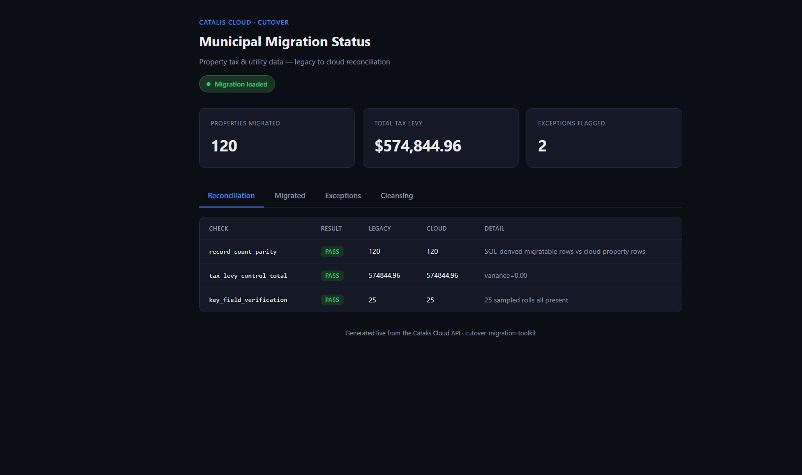
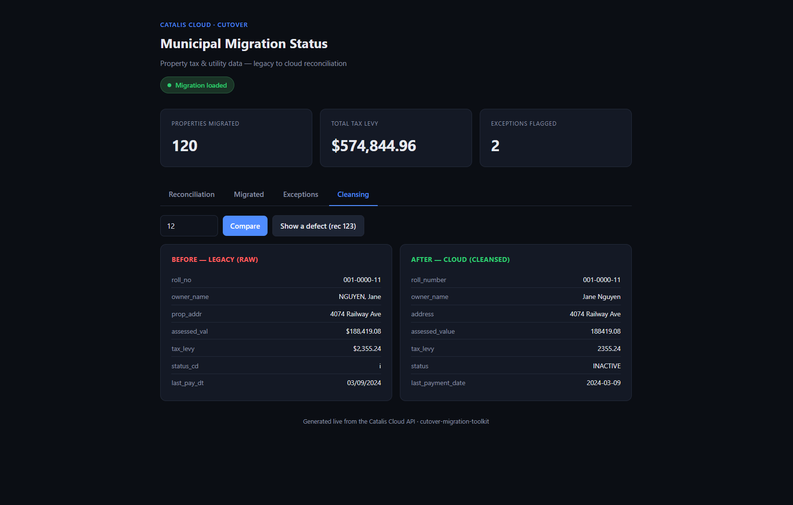

# Cutover — Municipal ERP Data Migration & Reconciliation Toolkit

Cutover migrates messy municipal property-tax and utility data out of a legacy
system, loads it into a cloud platform through that platform's API, and then
**reconciles** the two systems to prove the migration was complete and correct
before go-live.

It's built to mirror the real shape of a legacy-to-cloud cutover: dirty source
data, an API-based target, control-total reconciliation, exception reporting,
and automated tests at every layer.

## Why it's built this way

A migration is only trustworthy if you can _prove_ nothing was lost, nothing was
invented, and the money still adds up. So the design separates two concerns:

1. **ETL** — extract from legacy, cleanse with pure, unit-tested rules, load
   through the cloud API.
2. **Reconciliation** — independently re-derive the expected results in SQL and
   compare them against what the cloud API reports. Two implementations, one
   answer. If they disagree, the migration doesn't ship.

## What the reconciliation checks

Running the reconciliation against the seeded data produces:

| Check                  | Result | Legacy | Cloud  | Detail                    |
| ---------------------- | ------ | ------ | ------ | ------------------------- |
| record_count_parity    | PASS   | 120    | 120    | SQL-derived vs cloud rows |
| tax_levy_control_total | PASS   | 574845 | 574845 | variance=0.00             |
| key_field_verification | PASS   | 25     | 25     | 25 sampled rolls present  |

The seed deliberately injects defects so the pipeline has something real to
catch: a duplicate roll, a malformed roll, unparseable money, an unknown status
code, an unrecognized date, a missing owner, and one utility account whose
stored balance drifted from its true transaction history. Five rows are
quarantined as exceptions (with reasons); the balance drift is found by a window
function recomputing the ledger from first principles.

## Screenshots

**Live migration explorer** — reconciliation status, migrated records, exception log, and a before/after cleansing view, all served live from the API.

**Before / after cleansing** — every legacy field shown raw next to its cleansed cloud value. Bad rows are rejected with a reason rather than silently dropped.

## Stack

- **Python 3.12**, **PyTest** (unit, integration, and Playwright e2e)
- **PostgreSQL 16** — CTEs, window functions, PL/pgSQL stored procedures, dynamic SQL
- **FastAPI** — the cloud target, loaded and validated over HTTP
- **httpx** — API client for load + validation
- **Playwright** — end-to-end test of the status dashboard

## Architecture

    legacy_muni (Postgres)            catalis_cloud (Postgres)
      legacy.tax_master   ──┐           app.property
      legacy.util_ledger  ──┤           app.utility_transaction
       (flat, dirty, text)  │           recon.* (window-fn stored procs)
                            │                 ▲
                  extract   │                 │ load via HTTP
                            ▼                 │
                     ┌──────────────┐   ┌─────┴────────────┐
                     │ etl/transform│──▶│ cloud/api (FastAPI)│
                     │  (pure rules)│   └──────────────────┘
                     └──────────────┘            ▲
                            │                     │ query
                            ▼                     │
                     ┌──────────────────────────┴─┐
                     │ reconcile/ (API vs legacy SQL)│
                     └────────────────────────────────┘

## Running it

Prereqs: PostgreSQL running locally with two databases, `legacy_muni` and
`catalis_cloud`. (A Docker Postgres works well; point `.env` at it.)

    pip install -e ".[dev]"
    playwright install chromium
    copy .env.example .env          # adjust credentials

    python -m scripts.setup_db      # apply schemas + seed dirty legacy data

    # terminal 1: start the cloud API
    python -m uvicorn cutover.cloud.api:app --port 8000

    # terminal 2: migrate, then reconcile
    python -m scripts.run_migration
    python -m scripts.run_reconciliation

## Tests

    python -m pytest                # full suite
    python -m pytest tests/unit     # pure logic only (no DB needed)

Unit tests cover every cleansing rule and its failure modes. Integration tests
run the real extract/transform/load path against Postgres and the API, then run
every reconciliation check. The e2e test boots the API and drives a headless
browser over the dashboard.

## What this demonstrates

- **Python + test automation** — PyTest across unit, integration, and Playwright e2e layers, run in CI on every push.
- **API-based validation** — the migration loads through a FastAPI cloud target, and reconciliation queries that API and checks it against legacy SQL.
- **Advanced PostgreSQL** — CTEs, window functions, PL/pgSQL stored procedures, and dynamic SQL drive the reconciliation and anomaly detection.
- **ETL & data cleansing** — pure, unit-tested rules normalize dirty legacy text (money, dates, roll numbers, names, status codes) into typed cloud records.
- **Reconciliation & exception reporting** — record-count parity, financial control totals, key-field verification, duplicate detection, and a persisted exception log.
- **CI/CD** — GitHub Actions provisions a real Postgres, runs the full suite, and gates every change.
